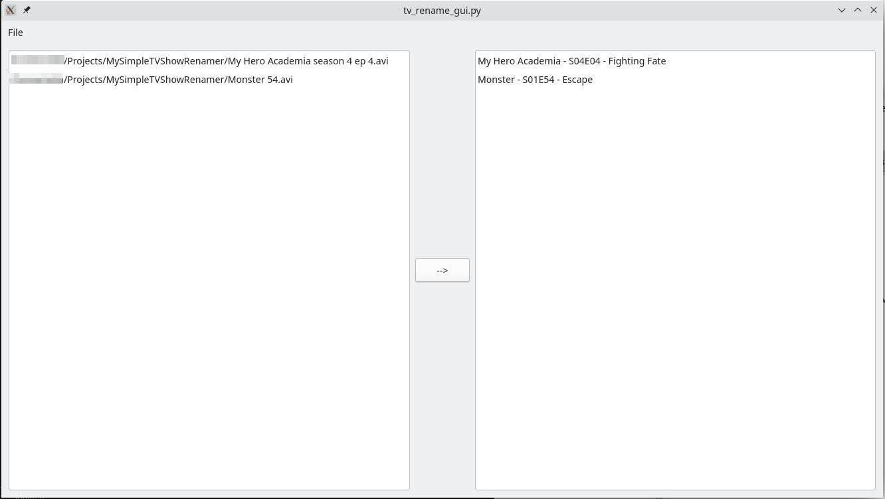

# Simple TV Show Renamer

Python script that help rename your TV Show files with a standard format.

## Description

Simple renamer that analyze the file name and try to find the TV Show that latches the best in TheMovieDb and seek for the episode name in order to rename the file. There is two functions to do it, one relies on selenium and parses TheMovieDb Website and the other uses the api and the library tmdbv3api.

## Getting Started

### Dependencies

* Python 3.x
* selenium or tmdbv3api
* BeautifulSoup4

### Executing program

You can use the CLI for the API usage (which requires a TMDB [account](https://www.themoviedb.org/documentation/api))

```bash
python tv_rename_cli.py --filenames "<YOUR Files>" --dry-run -v # to see end result

```

Or use the Selenium version, which parse the TMDB website (doesn't require an API key but requires the installation of the geckodriver)

Heres a screenshot of the gui flow



## License

This project is licensed under the MIT License - see the LICENSE.md file for details

## Acknowledgments

Inspiration, code snippets, etc.
* [Kodi-Regexes](https://kodi.wiki/view/Advancedsettings.xml#tvshowmatching)
